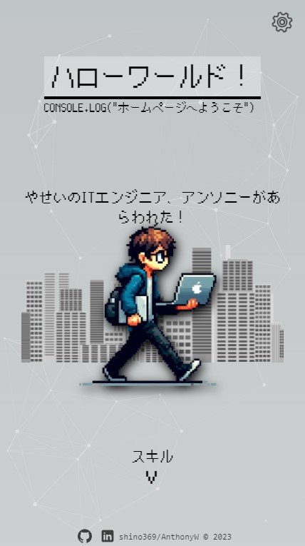
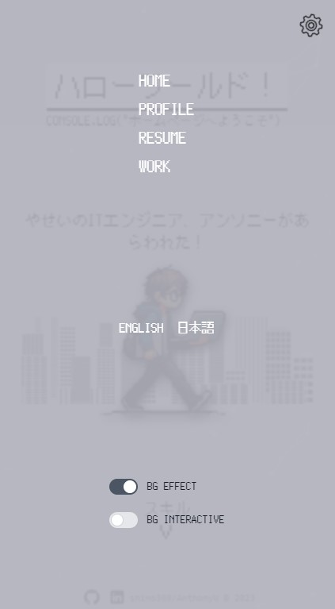
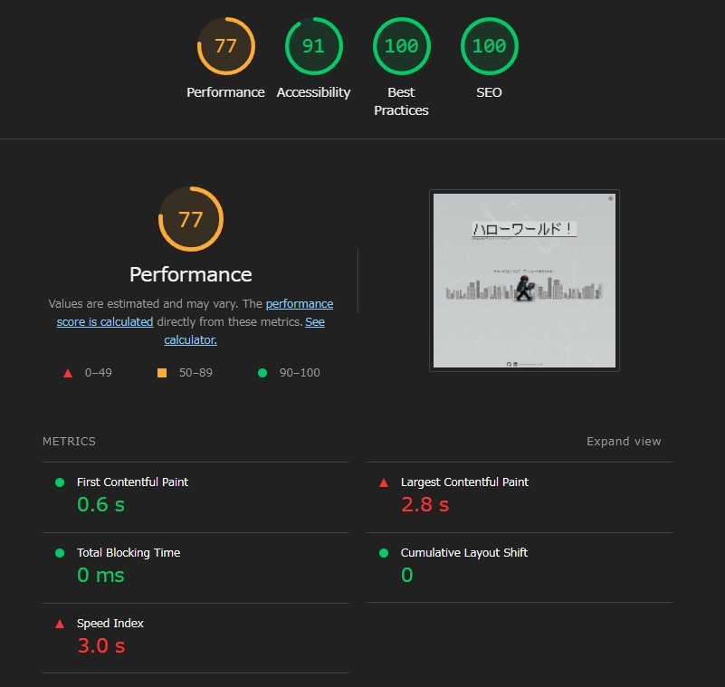

# Personal homepage updated with [Next.js 14](https://nextjs.org/) app router
This is a personal homepage made with [Next.js](https://nextjs.org/) bootstrapped with [`create-next-app`](https://github.com/vercel/next.js/tree/canary/packages/create-next-app).

https://shino369.github.io/ja

- Localization supported with [nex-intl](https://next-intl-docs.vercel.app/)
- Client side with [redux toolkit](https://redux-toolkit.js.org/)
- Animation with [framer motion](https://www.framer.com/motion/)
- Deployed with github action
- Form validation with [react hook form](https://react-hook-form.com/) and [zod](https://zod.dev/)
- Styled with [tailwindCSS](https://tailwindcss.com/)

    
    

\
Light house rating not quite good due to bad image optimization.

\
Just for demo usage. May add blog post in the future lmao. But I'm not going to fix this for now.

## 

To be honest it's not a good idea to use Next.js 13.4 or 14 app router version in production. I would rather use back page router. This version Next.js itself contains bugs everwyhere. (please refer to [open issues](https://github.com/vercel/next.js/issues)). While using `framer motion` I encounted several bugs that directly broke the app. And the support of `nex-intl` is still not quite good enough.